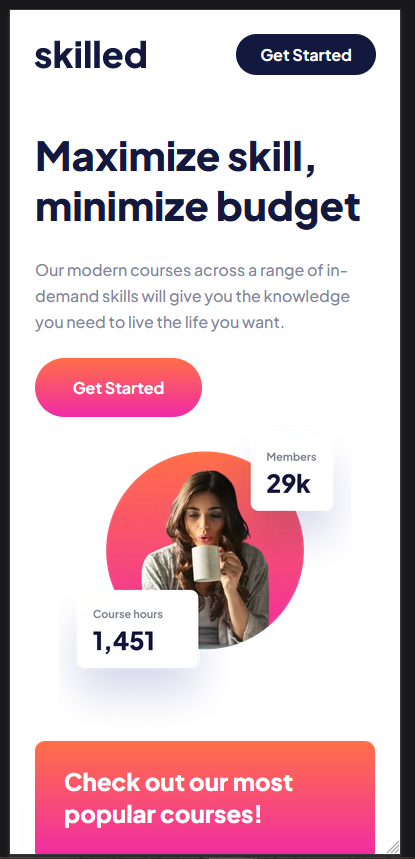
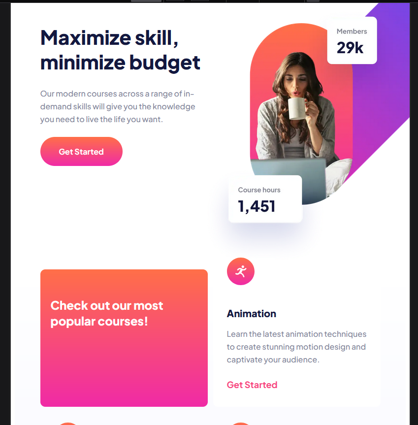
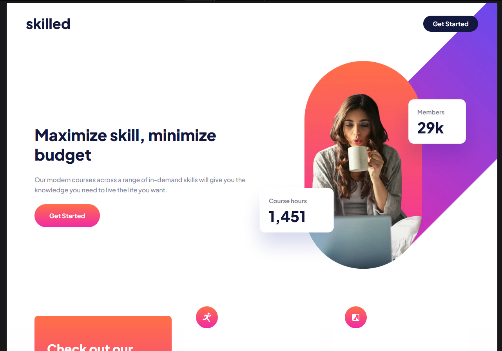

# Frontend Mentor - Skilled e-learning landing page solution

This is a solution to the [Skilled e-learning landing page challenge on Frontend Mentor](https://www.frontendmentor.io/challenges/skilled-elearning-landing-page-S1ObDrZ8q). Frontend Mentor challenges help you improve your coding skills by building realistic projects.

## Table of contents

- [Overview](#overview)
  - [The challenge](#the-challenge)
  - [Screenshot](#screenshot)
  - [Links](#links)
- [My process](#my-process)
  - [Built with](#built-with)
  - [What I learned](#what-i-learned)
- [Author](#author)

## Overview

### The challenge

Users should be able to:

- View the optimal layout depending on their device's screen size
- See hover states for interactive elements

### Screenshot

### Links

- Solution URL: https://github.com/jenmurph4610/Skilled-e-learning-landing-page
- Live Site URL: https://jenmurph4610.github.io/Skilled-e-learning-landing-page/

## My process

### Built with

- Semantic HTML5 markup
- CSS custom properties
- Flexbox
- CSS Grid
- Mobile-first workflow

### What I learned

I started this project off studying the designs and trying to determine the best method to go about achieving the layout.  I don't really remember why at this point but I opted to work with flexbox throughout and not utilizing grid.  However I still ended up re-doing the CSS and starting over about halfway through when my CSS started to get more bloated and seemingly more complex than it needed to be.  I rearranged the card section using grid this time and yes, it did end up being quite a bit simpler than my first attempt.  

At first I thought the small circle images layered on the corner of each card was going to be the challenging part of this project.  Looks are decieving for sure because that was one of the easiest parts.  It was the desktop and tablet versions of the hero section that gave me the most challenge, getting the picture positioned in particular.  

I am not 100% happy with the header section.  More specificly how wide the logo hangs to the left at larger desktop sizes. However I did try a number of variations and I liked those even less so I'm going with this for now.

All in all, the revamping of the CSS halfway through actually helped me gain more understanding on layouts and I am gaining more comfort adn confidenge with them in each challenge I complete.  

## Author

- Frontend Mentor - [@jenmurph4610](https://www.frontendmentor.io/profile/jenmurph4610)